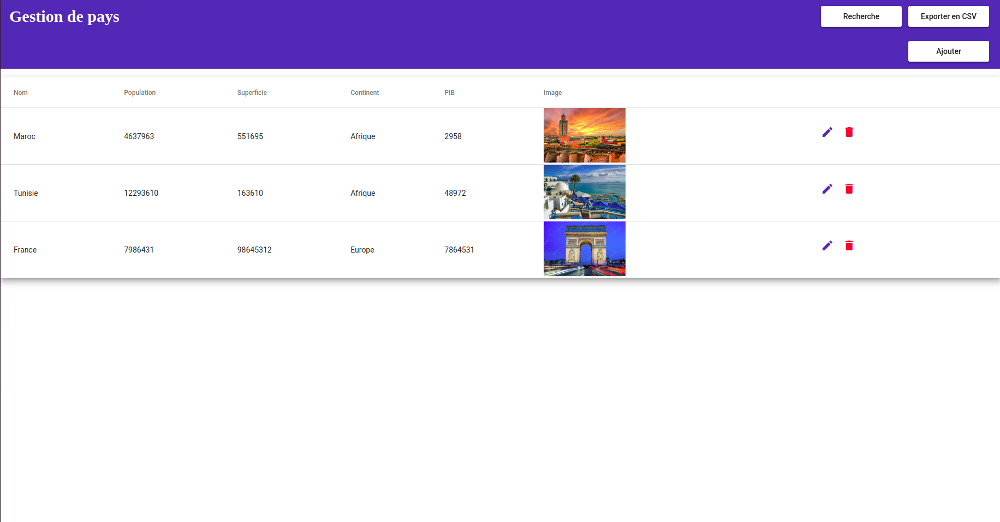
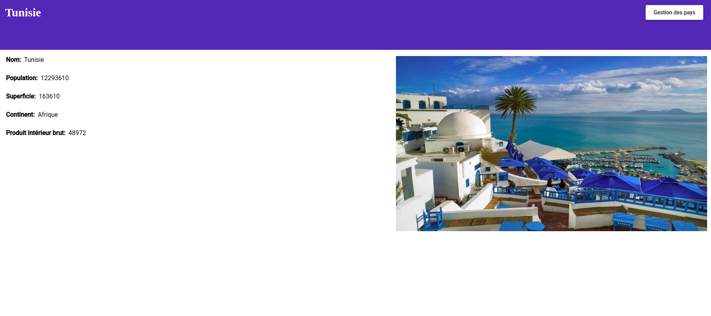

# $\mathcal{{CountriesApp} \ \}$
### $\ \{Front \ end \ app \ with \ Angular \ 13 \ for \ managing \ countries }$ 

### • $\ \ \textcolor{blueviolet}{run-server-with}$  : $\ \{json-server \ --watch \  \ db.json }$   
  
    

