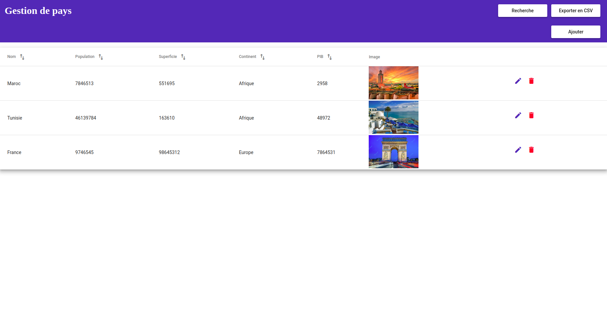
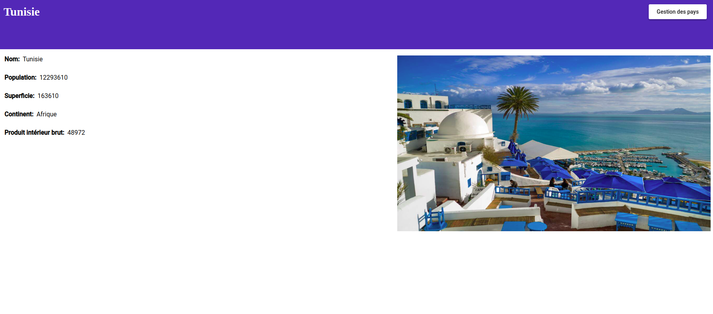

# $\mathcal{{CountriesApp} \ \}$
### $\ \{Front \ end \ app \ with \ Angular \ 13 \ for \ managing \ countries }$ 

### • <kbd>𝘥𝘰𝘸𝘯𝘭𝘰𝘢𝘥 𝘵𝘩𝘦 𝘥𝘦𝘱𝘦𝘯𝘥𝘦𝘯𝘤𝘪𝘦𝘴:</kbd>  : 𝒏𝒑𝒎 𝒊
### • <kbd>𝘳𝘶𝘯 𝘵𝘩𝘦 𝘫𝘴𝘰𝘯 𝘴𝘦𝘳𝘷𝘦𝘳:</kbd>  : 𝒋𝒔𝒐𝒏-𝒔𝒆𝒓𝒗𝒆𝒓 --𝒘𝒂𝒕𝒄𝒉 𝒅𝒃.𝒋𝒔𝒐𝒏
### • <kbd>𝘳𝘶𝘯 𝘢𝘱𝘱</kbd>  : 𝒏𝒈 𝒔𝒆𝒓𝒗𝒆 

    

